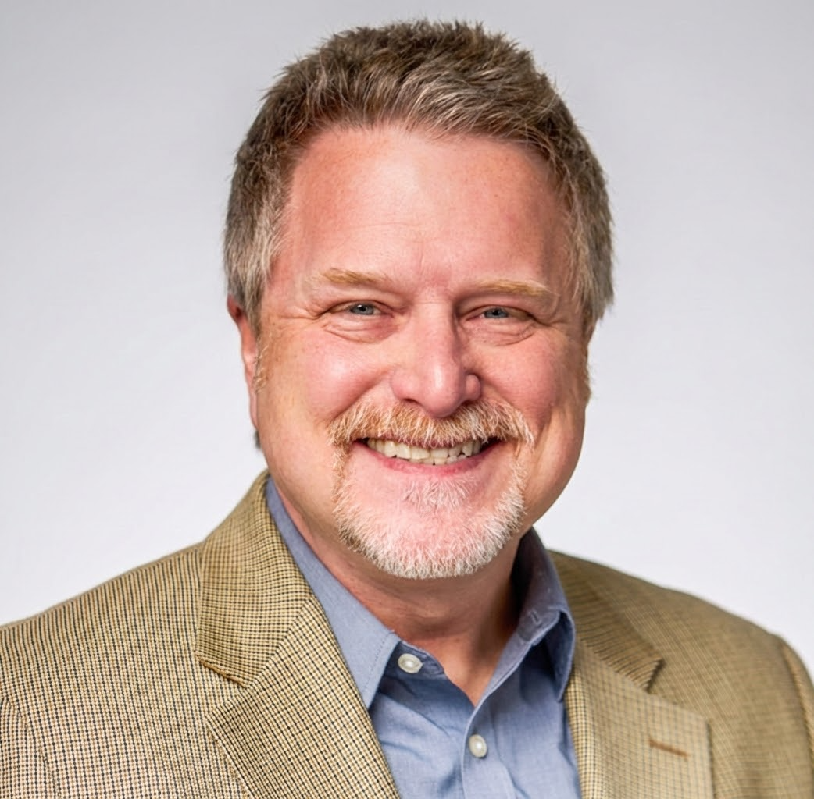

## About Me

Hello! I'm Darrell DeMakes, a passionate and dynamic individual with a knack for bringing ideas to life. My journey has led me through various exciting roles, always with a focus on uniting diverse teams to create impactful digital experiences. I thrive on leading projects from conception to successful launch, constantly learning and adapting to new challenges.

Beyond my professional endeavors, I'm deeply involved in my community. I've had the pleasure of hosting the Stamford AI Meetup and previously the Stamford Tech Meetup, fostering collaboration and knowledge sharing among fellow enthusiasts. I believe in continuous growth and leveraging technology to make a positive difference.

### Education
I hold a Bachelor of Science in Media Production, Management, and Technology from the University of Florida.

### Community Involvement
- New England Regional Manager —  AI Collective — 2026-Present
- Host — Stamford AI Meetup — 2024–Present
